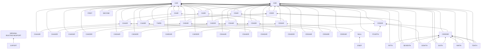

```mermaid
flowchart BT
id1885404356467[EXPORT]-->id1885404315955[NIRVANA-BUILTINS:%EXPORT]
id1885404357107[CAAR]-->id1885404319155[CAR]
id1885404357107[CAAR]-->id1885404319155[CAR]
id1885404352467[CADR]-->id1885404319155[CAR]
id1885404352467[CADR]-->id1885404321555[CDR]
id1885404353427[CDAR]-->id1885404321555[CDR]
id1885404353427[CDAR]-->id1885404319155[CAR]
id1885404351827[CDDR]-->id1885404321555[CDR]
id1885404351827[CDDR]-->id1885404321555[CDR]
id1885404349907[CAAAR]-->id1885404319155[CAR]
id1885404349907[CAAAR]-->id1885404357107[CAAR]
id1885404355507[CAADR]-->id1885404319155[CAR]
id1885404355507[CAADR]-->id1885404352467[CADR]
id1885404350867[CADAR]-->id1885404319155[CAR]
id1885404350867[CADAR]-->id1885404353427[CDAR]
id1885404356627[CADDR]-->id1885404319155[CAR]
id1885404356627[CADDR]-->id1885404351827[CDDR]
id1885404356787[CDAAR]-->id1885404321555[CDR]
id1885404356787[CDAAR]-->id1885404357107[CAAR]
id1885404356947[CDADR]-->id1885404321555[CDR]
id1885404356947[CDADR]-->id1885404352467[CADR]
id1885404354067[CDDAR]-->id1885404321555[CDR]
id1885404354067[CDDAR]-->id1885404353427[CDAR]
id1885404351187[CDDDR]-->id1885404321555[CDR]
id1885404351187[CDDDR]-->id1885404351827[CDDR]
id1885404352147[CAAAAR]-->id1885404319155[CAR]
id1885404352147[CAAAAR]-->id1885404349907[CAAAR]
id1885404354227[CAAADR]-->id1885404319155[CAR]
id1885404354227[CAAADR]-->id1885404355507[CAADR]
id1885404350067[CAADAR]-->id1885404319155[CAR]
id1885404350067[CAADAR]-->id1885404350867[CADAR]
id1885404350387[CAADDR]-->id1885404319155[CAR]
id1885404350387[CAADDR]-->id1885404356627[CADDR]
id1885404352947[CADAAR]-->id1885404319155[CAR]
id1885404352947[CADAAR]-->id1885404356787[CDAAR]
id1885404355187[CADADR]-->id1885404319155[CAR]
id1885404355187[CADADR]-->id1885404356947[CDADR]
id1885404356147[CADDAR]-->id1885404319155[CAR]
id1885404356147[CADDAR]-->id1885404354067[CDDAR]
id1885404352627[CADDDR]-->id1885404319155[CAR]
id1885404352627[CADDDR]-->id1885404351187[CDDDR]
id1885404349587[CDAAAR]-->id1885404321555[CDR]
id1885404349587[CDAAAR]-->id1885404349907[CAAAR]
id1885404352787[CDAADR]-->id1885404321555[CDR]
id1885404352787[CDAADR]-->id1885404355507[CAADR]
id1885404353587[CDADAR]-->id1885404321555[CDR]
id1885404353587[CDADAR]-->id1885404350867[CADAR]
id1885404354547[CDADDR]-->id1885404321555[CDR]
id1885404354547[CDADDR]-->id1885404356627[CADDR]
id1885404353747[CDDAAR]-->id1885404321555[CDR]
id1885404353747[CDDAAR]-->id1885404356787[CDAAR]
id1885404354387[CDDADR]-->id1885404321555[CDR]
id1885404354387[CDDADR]-->id1885404356947[CDADR]
id1885404355027[CDDDAR]-->id1885404321555[CDR]
id1885404355027[CDDDAR]-->id1885404354067[CDDAR]
id1885404355827[CDDDDR]-->id1885404321555[CDR]
id1885404355827[CDDDDR]-->id1885404351187[CDDDR]
id1885404354867[FIRST]-->id1885404319155[CAR]
id1885404349267[SECOND]-->id1885404319155[CAR]
id1885404349267[SECOND]-->id1885404321555[CDR]
id1885404355667[THIRD]-->id1885404319155[CAR]
id1885404355667[THIRD]-->id1885404351827[CDDR]
id1885404355987[FOURTH]-->id1885404319155[CAR]
id1885404355987[FOURTH]-->id1885404351187[CDDDR]
id1885404349427[FIFTH]-->id1885404319155[CAR]
id1885404349427[FIFTH]-->id1885404355827[CDDDDR]
id1885404353907[SIXTH]-->id1885404319155[CAR]
id1885404353907[SIXTH]-->id1885404321555[CDR]
id1885404353907[SIXTH]-->id1885404355827[CDDDDR]
id1885404350547[SEVENTH]-->id1885404319155[CAR]
id1885404350547[SEVENTH]-->id1885404351827[CDDR]
id1885404350547[SEVENTH]-->id1885404355827[CDDDDR]
id1885404350707[EIGHTH]-->id1885404319155[CAR]
id1885404350707[EIGHTH]-->id1885404351187[CDDDR]
id1885404350707[EIGHTH]-->id1885404355827[CDDDDR]
id1885404351027[NINTH]-->id1885404319155[CAR]
id1885404351027[NINTH]-->id1885404355827[CDDDDR]
id1885404351027[NINTH]-->id1885404355827[CDDDDR]
id1885404351507[TENTH]-->id1885404319155[CAR]
id1885404351507[TENTH]-->id1885404321555[CDR]
id1885404351507[TENTH]-->id1885404355827[CDDDDR]
id1885404351507[TENTH]-->id1885404355827[CDDDDR]
id1885404354707[ENDP]-->id1885404317555[NULL]
```
