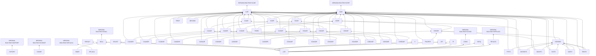

```mermaid
flowchart BT
id1508152317347[EXPORT]-->id1508152294707[NIRVANA-BUILTINS:%EXPORT]
id1508152315267[CONS]-->id1508152296307[NIRVANA-BUILTINS:%CONS]
id1508152315587[CONSP]-->id1508152298227[NIRVANA-BUILTINS:%CONSP]
id1508152314947[NULL]-->id1508152292467[NIRVANA-BUILTINS:%NULL]
id1508152321027[CAR]-->id1508152298707[NIRVANA-BUILTINS:%CAR]
id1508152319107[CDR]-->id1508152296147[NIRVANA-BUILTINS:%CDR]
id1508152378627[RPLACA]-->id1508152298867[NIRVANA-BUILTINS:%RPLACA]
id1508152384227[RPLACD]-->id1508152295027[NIRVANA-BUILTINS:%RPLACD]
id1508152318307[CAAR]-->id1508152321027[CAR]
id1508152318307[CAAR]-->id1508152321027[CAR]
id1508152320707[CADR]-->id1508152321027[CAR]
id1508152320707[CADR]-->id1508152319107[CDR]
id1508152319267[CDAR]-->id1508152319107[CDR]
id1508152319267[CDAR]-->id1508152321027[CAR]
id1508152316867[CDDR]-->id1508152319107[CDR]
id1508152316867[CDDR]-->id1508152319107[CDR]
id1508152321187[CAAAR]-->id1508152321027[CAR]
id1508152321187[CAAAR]-->id1508152318307[CAAR]
id1508152315747[CAADR]-->id1508152321027[CAR]
id1508152315747[CAADR]-->id1508152320707[CADR]
id1508152316547[CADAR]-->id1508152321027[CAR]
id1508152316547[CADAR]-->id1508152319267[CDAR]
id1508152315907[CADDR]-->id1508152321027[CAR]
id1508152315907[CADDR]-->id1508152316867[CDDR]
id1508152316067[CDAAR]-->id1508152319107[CDR]
id1508152316067[CDAAR]-->id1508152318307[CAAR]
id1508152320867[CDADR]-->id1508152319107[CDR]
id1508152320867[CDADR]-->id1508152320707[CADR]
id1508152316227[CDDAR]-->id1508152319107[CDR]
id1508152316227[CDDAR]-->id1508152319267[CDAR]
id1508152314467[CDDDR]-->id1508152319107[CDR]
id1508152314467[CDDDR]-->id1508152316867[CDDR]
id1508152319427[CAAAAR]-->id1508152321027[CAR]
id1508152319427[CAAAAR]-->id1508152321187[CAAAR]
id1508152318147[CAAADR]-->id1508152321027[CAR]
id1508152318147[CAAADR]-->id1508152315747[CAADR]
id1508152321987[CAADAR]-->id1508152321027[CAR]
id1508152321987[CAADAR]-->id1508152316547[CADAR]
id1508152319907[CAADDR]-->id1508152321027[CAR]
id1508152319907[CAADDR]-->id1508152315907[CADDR]
id1508152320387[CADAAR]-->id1508152321027[CAR]
id1508152320387[CADAAR]-->id1508152316067[CDAAR]
id1508152320547[CADADR]-->id1508152321027[CAR]
id1508152320547[CADADR]-->id1508152320867[CDADR]
id1508152317027[CADDAR]-->id1508152321027[CAR]
id1508152317027[CADDAR]-->id1508152316227[CDDAR]
id1508152316707[CADDDR]-->id1508152321027[CAR]
id1508152316707[CADDDR]-->id1508152314467[CDDDR]
id1508152321347[CDAAAR]-->id1508152319107[CDR]
id1508152321347[CDAAAR]-->id1508152321187[CAAAR]
id1508152317507[CDAADR]-->id1508152319107[CDR]
id1508152317507[CDAADR]-->id1508152315747[CAADR]
id1508152321507[CDADAR]-->id1508152319107[CDR]
id1508152321507[CDADAR]-->id1508152316547[CADAR]
id1508152319587[CDADDR]-->id1508152319107[CDR]
id1508152319587[CDADDR]-->id1508152315907[CADDR]
id1508152318467[CDDAAR]-->id1508152319107[CDR]
id1508152318467[CDDAAR]-->id1508152316067[CDAAR]
id1508152318627[CDDADR]-->id1508152319107[CDR]
id1508152318627[CDDADR]-->id1508152320867[CDADR]
id1508152318787[CDDDAR]-->id1508152319107[CDR]
id1508152318787[CDDDAR]-->id1508152316227[CDDAR]
id1508152318947[CDDDDR]-->id1508152319107[CDR]
id1508152318947[CDDDDR]-->id1508152314467[CDDDR]
id1508152321827[FIRST]-->id1508152321027[CAR]
id1508152322147[SECOND]-->id1508152321027[CAR]
id1508152322147[SECOND]-->id1508152319107[CDR]
id1508152319747[THIRD]-->id1508152321027[CAR]
id1508152319747[THIRD]-->id1508152316867[CDDR]
id1508152320067[FOURTH]-->id1508152321027[CAR]
id1508152320067[FOURTH]-->id1508152314467[CDDDR]
id1508152314307[FIFTH]-->id1508152321027[CAR]
id1508152314307[FIFTH]-->id1508152318947[CDDDDR]
id1508152384067[SIXTH]-->id1508152321027[CAR]
id1508152384067[SIXTH]-->id1508152319107[CDR]
id1508152384067[SIXTH]-->id1508152318947[CDDDDR]
id1508152380547[SEVENTH]-->id1508152321027[CAR]
id1508152380547[SEVENTH]-->id1508152316867[CDDR]
id1508152380547[SEVENTH]-->id1508152318947[CDDDDR]
id1508152383747[EIGHTH]-->id1508152321027[CAR]
id1508152383747[EIGHTH]-->id1508152314467[CDDDR]
id1508152383747[EIGHTH]-->id1508152318947[CDDDDR]
id1508152385827[NINTH]-->id1508152321027[CAR]
id1508152385827[NINTH]-->id1508152318947[CDDDDR]
id1508152385827[NINTH]-->id1508152318947[CDDDDR]
id1508152385987[TENTH]-->id1508152321027[CAR]
id1508152385987[TENTH]-->id1508152319107[CDR]
id1508152385987[TENTH]-->id1508152318947[CDDDDR]
id1508152385987[TENTH]-->id1508152318947[CDDDDR]
id1508152378787[ENDP]-->id1508152314947[NULL]
id1508152378947[LIST]-->id1508152272051[LET]
id1508152378947[LIST]-->id1508152382627[RESULT]
id1508152378947[LIST]-->id1508152379107[DOLIST]
id1508152378947[LIST]-->id1508152382467[X]
id1508152378947[LIST]-->id1508152272547[IF]
id1508152378947[LIST]-->id1508152314947[NULL]
id1508152378947[LIST]-->id1508152275571[SETQ]
id1508152378947[LIST]-->id1508152315267[CONS]
id1508152378947[LIST]-->id1508152272051[LET]
id1508152378947[LIST]-->id1508152384227[RPLACD]
id1508152378947[LIST]-->id1508152275571[SETQ]
```
