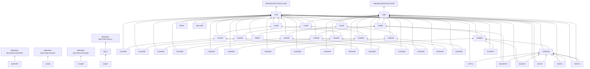

```mermaid
flowchart BT
id2500346790083[EXPORT]-->id2500346755059[NIRVANA-BUILTINS:%EXPORT]
id2500346792163[CONS]-->id2500346758099[NIRVANA-BUILTINS:%CONS]
id2500346794243[CONSP]-->id2500346758259[NIRVANA-BUILTINS:%CONSP]
id2500346788643[NULL]-->id2500346754259[NIRVANA-BUILTINS:%NULL]
id2500346792483[CAR]-->id2500346756179[NIRVANA-BUILTINS:%CAR]
id2500346794883[CDR]-->id2500346759859[NIRVANA-BUILTINS:%CDR]
id2500346789603[CAAR]-->id2500346792483[CAR]
id2500346789603[CAAR]-->id2500346792483[CAR]
id2500346788323[CADR]-->id2500346792483[CAR]
id2500346788323[CADR]-->id2500346794883[CDR]
id2500346789923[CDAR]-->id2500346794883[CDR]
id2500346789923[CDAR]-->id2500346792483[CAR]
id2500346789763[CDDR]-->id2500346794883[CDR]
id2500346789763[CDDR]-->id2500346794883[CDR]
id2500346794403[CAAAR]-->id2500346792483[CAR]
id2500346794403[CAAAR]-->id2500346789603[CAAR]
id2500346790243[CAADR]-->id2500346792483[CAR]
id2500346790243[CAADR]-->id2500346788323[CADR]
id2500346789123[CADAR]-->id2500346792483[CAR]
id2500346789123[CADAR]-->id2500346789923[CDAR]
id2500346791363[CADDR]-->id2500346792483[CAR]
id2500346791363[CADDR]-->id2500346789763[CDDR]
id2500346787683[CDAAR]-->id2500346794883[CDR]
id2500346787683[CDAAR]-->id2500346789603[CAAR]
id2500346788803[CDADR]-->id2500346794883[CDR]
id2500346788803[CDADR]-->id2500346788323[CADR]
id2500346792643[CDDAR]-->id2500346794883[CDR]
id2500346792643[CDDAR]-->id2500346789923[CDAR]
id2500346794563[CDDDR]-->id2500346794883[CDR]
id2500346794563[CDDDR]-->id2500346789763[CDDR]
id2500346791523[CAAAAR]-->id2500346792483[CAR]
id2500346791523[CAAAAR]-->id2500346794403[CAAAR]
id2500346789283[CAAADR]-->id2500346792483[CAR]
id2500346789283[CAAADR]-->id2500346790243[CAADR]
id2500346793443[CAADAR]-->id2500346792483[CAR]
id2500346793443[CAADAR]-->id2500346789123[CADAR]
id2500346793123[CAADDR]-->id2500346792483[CAR]
id2500346793123[CAADDR]-->id2500346791363[CADDR]
id2500346788963[CADAAR]-->id2500346792483[CAR]
id2500346788963[CADAAR]-->id2500346787683[CDAAR]
id2500346793763[CADADR]-->id2500346792483[CAR]
id2500346793763[CADADR]-->id2500346788803[CDADR]
id2500346790403[CADDAR]-->id2500346792483[CAR]
id2500346790403[CADDAR]-->id2500346792643[CDDAR]
id2500346787843[CADDDR]-->id2500346792483[CAR]
id2500346787843[CADDDR]-->id2500346794563[CDDDR]
id2500346789443[CDAAAR]-->id2500346794883[CDR]
id2500346789443[CDAAAR]-->id2500346794403[CAAAR]
id2500346791683[CDAADR]-->id2500346794883[CDR]
id2500346791683[CDAADR]-->id2500346790243[CAADR]
id2500346794723[CDADAR]-->id2500346794883[CDR]
id2500346794723[CDADAR]-->id2500346789123[CADAR]
id2500346795043[CDADDR]-->id2500346794883[CDR]
id2500346795043[CDADDR]-->id2500346791363[CADDR]
id2500346790563[CDDAAR]-->id2500346794883[CDR]
id2500346790563[CDDAAR]-->id2500346787683[CDAAR]
id2500346795203[CDDADR]-->id2500346794883[CDR]
id2500346795203[CDDADR]-->id2500346788803[CDADR]
id2500346790723[CDDDAR]-->id2500346794883[CDR]
id2500346790723[CDDDAR]-->id2500346792643[CDDAR]
id2500346792323[CDDDDR]-->id2500346794883[CDR]
id2500346792323[CDDDDR]-->id2500346794563[CDDDR]
id2500346790883[FIRST]-->id2500346792483[CAR]
id2500346791043[SECOND]-->id2500346792483[CAR]
id2500346791043[SECOND]-->id2500346794883[CDR]
id2500346787363[THIRD]-->id2500346792483[CAR]
id2500346787363[THIRD]-->id2500346789763[CDDR]
id2500346791203[FOURTH]-->id2500346792483[CAR]
id2500346791203[FOURTH]-->id2500346794563[CDDDR]
id2500346791843[FIFTH]-->id2500346792483[CAR]
id2500346791843[FIFTH]-->id2500346792323[CDDDDR]
id2500346787523[SIXTH]-->id2500346792483[CAR]
id2500346787523[SIXTH]-->id2500346794883[CDR]
id2500346787523[SIXTH]-->id2500346792323[CDDDDR]
id2500346792003[SEVENTH]-->id2500346792483[CAR]
id2500346792003[SEVENTH]-->id2500346789763[CDDR]
id2500346792003[SEVENTH]-->id2500346792323[CDDDDR]
id2500346845747[EIGHTH]-->id2500346792483[CAR]
id2500346845747[EIGHTH]-->id2500346794563[CDDDR]
id2500346845747[EIGHTH]-->id2500346792323[CDDDDR]
id2500346844147[NINTH]-->id2500346792483[CAR]
id2500346844147[NINTH]-->id2500346792323[CDDDDR]
id2500346844147[NINTH]-->id2500346792323[CDDDDR]
id2500346842227[TENTH]-->id2500346792483[CAR]
id2500346842227[TENTH]-->id2500346794883[CDR]
id2500346842227[TENTH]-->id2500346792323[CDDDDR]
id2500346842227[TENTH]-->id2500346792323[CDDDDR]
id2500346839987[ENDP]-->id2500346788643[NULL]
```
