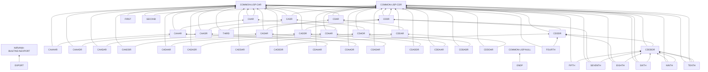

```mermaid
flowchart BT
id2246973142611[EXPORT]-->id2246973110419[NIRVANA-BUILTINS:%EXPORT]
id2246973142771[CAAR]-->id2246973112179[COMMON-LISP:CAR]
id2246973142771[CAAR]-->id2246973112179[COMMON-LISP:CAR]
id2246973143731[CADR]-->id2246973112179[COMMON-LISP:CAR]
id2246973143731[CADR]-->id2246973107699[COMMON-LISP:CDR]
id2246973141331[CDAR]-->id2246973107699[COMMON-LISP:CDR]
id2246973141331[CDAR]-->id2246973112179[COMMON-LISP:CAR]
id2246973144051[CDDR]-->id2246973107699[COMMON-LISP:CDR]
id2246973144051[CDDR]-->id2246973107699[COMMON-LISP:CDR]
id2246973144211[CAAAR]-->id2246973112179[COMMON-LISP:CAR]
id2246973144211[CAAAR]-->id2246973142771[CAAR]
id2246973144691[CAADR]-->id2246973112179[COMMON-LISP:CAR]
id2246973144691[CAADR]-->id2246973143731[CADR]
id2246973141811[CADAR]-->id2246973112179[COMMON-LISP:CAR]
id2246973141811[CADAR]-->id2246973141331[CDAR]
id2246973144851[CADDR]-->id2246973112179[COMMON-LISP:CAR]
id2246973144851[CADDR]-->id2246973144051[CDDR]
id2246973141491[CDAAR]-->id2246973107699[COMMON-LISP:CDR]
id2246973141491[CDAAR]-->id2246973142771[CAAR]
id2246973141971[CDADR]-->id2246973107699[COMMON-LISP:CDR]
id2246973141971[CDADR]-->id2246973143731[CADR]
id2246973141651[CDDAR]-->id2246973107699[COMMON-LISP:CDR]
id2246973141651[CDDAR]-->id2246973141331[CDAR]
id2246973142291[CDDDR]-->id2246973107699[COMMON-LISP:CDR]
id2246973142291[CDDDR]-->id2246973144051[CDDR]
id2246973142931[CAAAAR]-->id2246973112179[COMMON-LISP:CAR]
id2246973142931[CAAAAR]-->id2246973144211[CAAAR]
id2246973143251[CAAADR]-->id2246973112179[COMMON-LISP:CAR]
id2246973143251[CAAADR]-->id2246973144691[CAADR]
id2246973180163[CAADAR]-->id2246973112179[COMMON-LISP:CAR]
id2246973180163[CAADAR]-->id2246973141811[CADAR]
id2246973177603[CAADDR]-->id2246973112179[COMMON-LISP:CAR]
id2246973177603[CAADDR]-->id2246973144851[CADDR]
id2246973182083[CADAAR]-->id2246973112179[COMMON-LISP:CAR]
id2246973182083[CADAAR]-->id2246973141491[CDAAR]
id2246973182723[CADADR]-->id2246973112179[COMMON-LISP:CAR]
id2246973182723[CADADR]-->id2246973141971[CDADR]
id2246973179363[CADDAR]-->id2246973112179[COMMON-LISP:CAR]
id2246973179363[CADDAR]-->id2246973141651[CDDAR]
id2246973184963[CADDDR]-->id2246973112179[COMMON-LISP:CAR]
id2246973184963[CADDDR]-->id2246973142291[CDDDR]
id2246973182883[CDAAAR]-->id2246973107699[COMMON-LISP:CDR]
id2246973182883[CDAAAR]-->id2246973144211[CAAAR]
id2246973180323[CDAADR]-->id2246973107699[COMMON-LISP:CDR]
id2246973180323[CDAADR]-->id2246973144691[CAADR]
id2246973185123[CDADAR]-->id2246973107699[COMMON-LISP:CDR]
id2246973185123[CDADAR]-->id2246973141811[CADAR]
id2246973184323[CDADDR]-->id2246973107699[COMMON-LISP:CDR]
id2246973184323[CDADDR]-->id2246973144851[CADDR]
id2246973177923[CDDAAR]-->id2246973107699[COMMON-LISP:CDR]
id2246973177923[CDDAAR]-->id2246973141491[CDAAR]
id2246973179843[CDDADR]-->id2246973107699[COMMON-LISP:CDR]
id2246973179843[CDDADR]-->id2246973141971[CDADR]
id2246973182563[CDDDAR]-->id2246973107699[COMMON-LISP:CDR]
id2246973182563[CDDDAR]-->id2246973141651[CDDAR]
id2246973184163[CDDDDR]-->id2246973107699[COMMON-LISP:CDR]
id2246973184163[CDDDDR]-->id2246973142291[CDDDR]
id2246973179523[FIRST]-->id2246973112179[COMMON-LISP:CAR]
id2246973178083[SECOND]-->id2246973112179[COMMON-LISP:CAR]
id2246973178083[SECOND]-->id2246973107699[COMMON-LISP:CDR]
id2246973178243[THIRD]-->id2246973112179[COMMON-LISP:CAR]
id2246973178243[THIRD]-->id2246973144051[CDDR]
id2246973183043[FOURTH]-->id2246973112179[COMMON-LISP:CAR]
id2246973183043[FOURTH]-->id2246973142291[CDDDR]
id2246973179683[FIFTH]-->id2246973112179[COMMON-LISP:CAR]
id2246973179683[FIFTH]-->id2246973184163[CDDDDR]
id2246973178883[SIXTH]-->id2246973112179[COMMON-LISP:CAR]
id2246973178883[SIXTH]-->id2246973107699[COMMON-LISP:CDR]
id2246973178883[SIXTH]-->id2246973184163[CDDDDR]
id2246973183203[SEVENTH]-->id2246973112179[COMMON-LISP:CAR]
id2246973183203[SEVENTH]-->id2246973144051[CDDR]
id2246973183203[SEVENTH]-->id2246973184163[CDDDDR]
id2246973181763[EIGHTH]-->id2246973112179[COMMON-LISP:CAR]
id2246973181763[EIGHTH]-->id2246973142291[CDDDR]
id2246973181763[EIGHTH]-->id2246973184163[CDDDDR]
id2246973181443[NINTH]-->id2246973112179[COMMON-LISP:CAR]
id2246973181443[NINTH]-->id2246973184163[CDDDDR]
id2246973181443[NINTH]-->id2246973184163[CDDDDR]
id2246973180483[TENTH]-->id2246973112179[COMMON-LISP:CAR]
id2246973180483[TENTH]-->id2246973107699[COMMON-LISP:CDR]
id2246973180483[TENTH]-->id2246973184163[CDDDDR]
id2246973180483[TENTH]-->id2246973184163[CDDDDR]
id2246973143571[ENDP]-->id2246973115539[COMMON-LISP:NULL]
```
